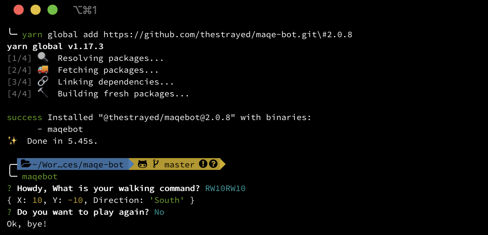
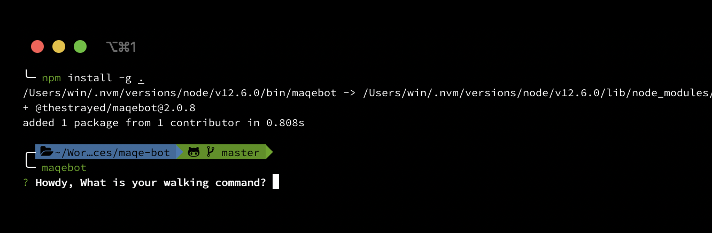

# MAQE Bot

[](https://circleci.com/gh/thestrayed/maqe-bot/tree/master)  [](https://coveralls.io/github/thestrayed/maqe-bot?branch=master)

This is my interpretation on how to solve MAQE Bot challenge from [MAQE challenge](http://maqe.github.io/maqe-bot.html).

# Overview

The goal of this bot is to return `X`, `Y`, and `Direction`.
Walking command can only be these followings:

| Command |Explanation|
|:--:|:--|
| W | Walk forward to that particular direction, step must be follow by this command |
| L | Turn left |
| R | Turn right|

```bash
RW10RW10
```

with the given input, what is answer of those steps?

| Key |Value|
|:--:|:--|
| X | X-axis |
| Y | Y-axis |
| Direction |North, East, South, West|

```typescript
{
    X: 10,
    Y: -10,
    Direction: 'South',
}
```

# Usage

### Run it as CLI with `yarn`



### Remove project from CLI

```bash
yarn global remove @thestrayed/maqebot
```

### Run it as CLI with `npm` locally

1. Clone project

1. Install project's dependencies

    ```bash
    yarn
    ```

1. Build project

    ```bash
    yarn build
    ```

1. Install to npm global locally



# Development

1. Start the CLI

    ```bash
    yarn dev
    ```

1. Build project

    ```bash
    yarn build
    ```

### Test

1. Running follow command to execute test

    ```bash
    yarn test
    ```


## References

- https://en.wikipedia.org/wiki/Cardinal_direction

- https://en.wikipedia.org/wiki/Relative_direction
